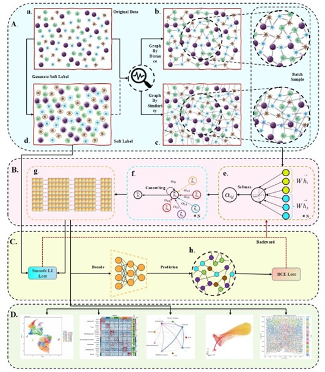
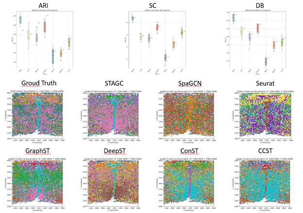
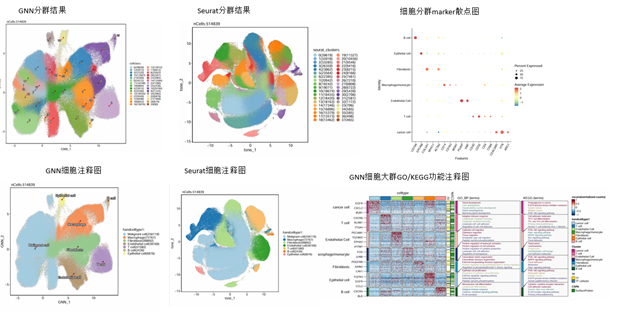
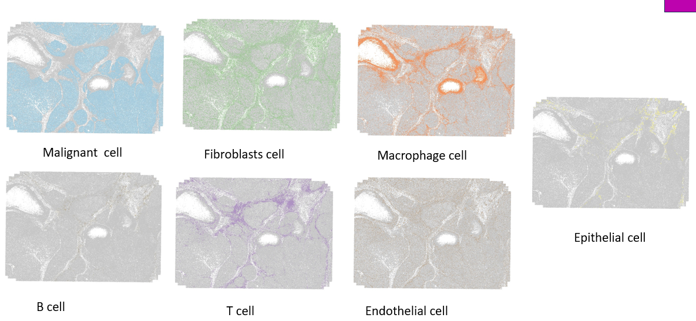
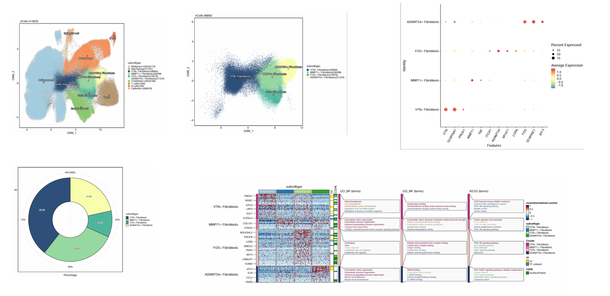
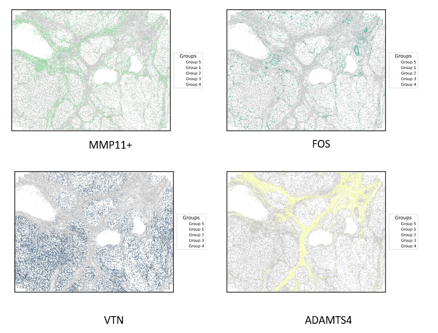
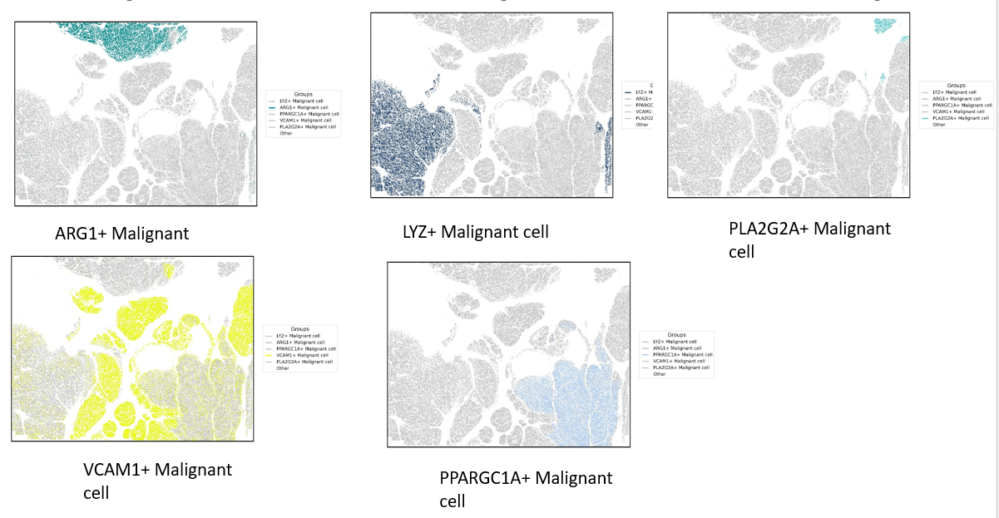

# STAGC

**In this paper, we propose Attribute Graph Clustering Driven Cell Map of Single Cell Spatial Transcriptome (STAGC), a clustering-driven graph autoencoder method that innovatively integrates spatial proximity and gene expression similarity to construct biologically meaningful graphs. By introducing a soft-label self-supervised mechanism, STAGC optimizes node embeddings specifically for clustering tasks. This approach addresses key limitations of conventional graph-based methods, which often overlook clustering objectives and rely too heavily on spatial distance alone. STAGC demonstrates superior performance in accurately identifying cell types and subpopulations from single-cell spatial transcriptomics data, making it a powerful tool for studying tumor heterogeneity and cell-cell communication.**


## Environment

Please install the necessary libraries according to the following requirements.  
This program support running in the Linux or Windows-WSL2 system.
We suggest using the conda-environment to manage your program.

### Dependency library

Please refer to the requirements.txt file to install the following libraries:

- `pytorch==2.5.1`
- `python==3.11`
- `tqdm`
- `pandas`
- `scikit-learn`
- `matplotlib`
- `numpy`
- `captum`
- `shutil`
- `igraph`
- `leidenalg`
- `cuml`
- `cudf`

You can use' pip' to install the project's dependency library:

```bash
pip install -r requirements.txt
```
### Run
## data preparation
Please make sure your data in the dir 'data'.
If your data is original merfish csv data, please run 

```bash
python sort_cell_id.py
```

```bash
python addxy.py
```

```bash
python split_graph.py
```
These scripts will sort the cells and merge the coordinates. Because of the large amount of single cell data in merfish space (hundreds of thousands), we use subgraph to reduce the computational overhead.

## Main
Then you can run the STAGC by typing the following from the command line:

```bash
python run_STAGC.py
```
## Cell letent space embedding generate
After the training, you can load the model to obtain the cell embedding by the following commands.

```bash
python generate_embedding.py
```

```bash
python merge embedding.py
```
## Cell Cluster
PCA and Umap of cells(Due to the large number of cells, we use gpu supported by cudf library for data acceleration.):
```bash
python pca_umap.py
```

Leiden clustering of cells:
```bash
python leiden_Cluster.py
```

### Result
Model:


Benchmark:



Liver cell cluster and annotations:



Liver cell vis:



Liver fibroblasts subclass cell analysis:



Liver fibroblasts cell subclass vis:



Liver cancer cell subclass vis.png:




